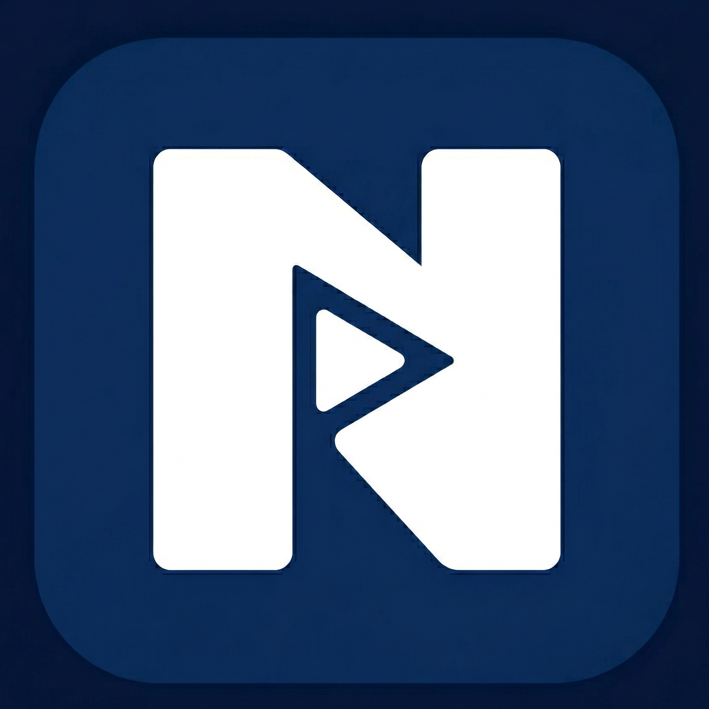
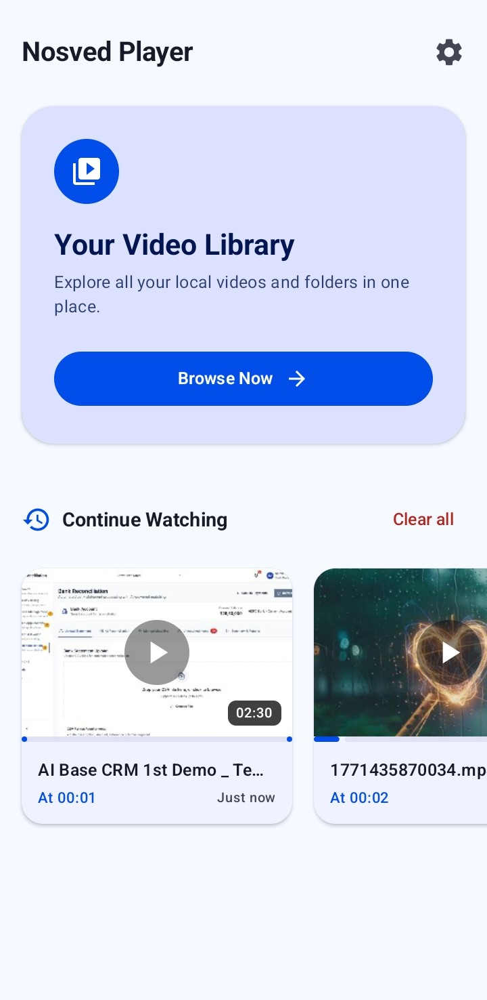
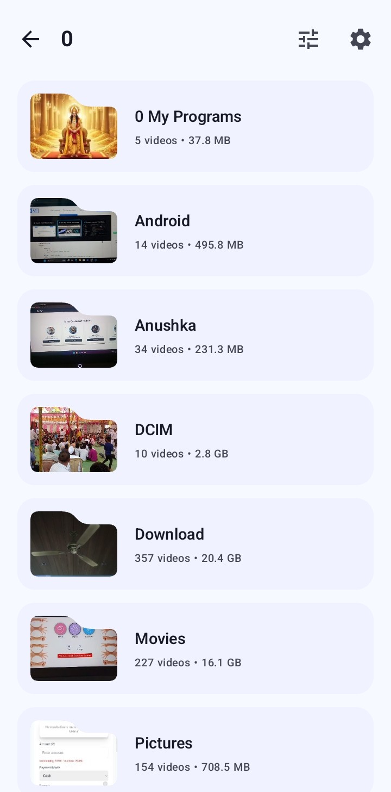
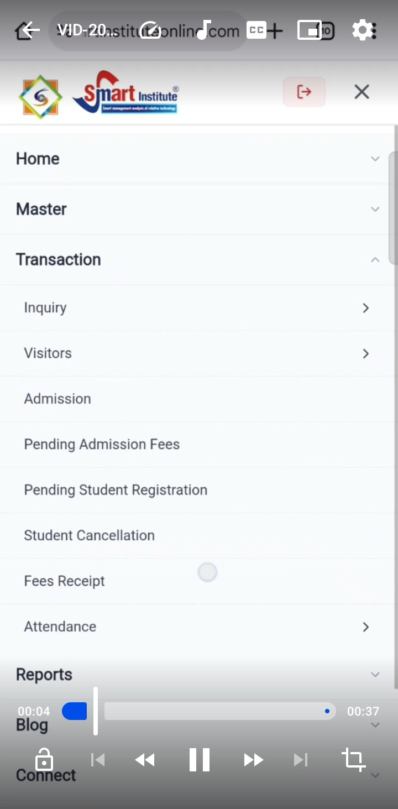
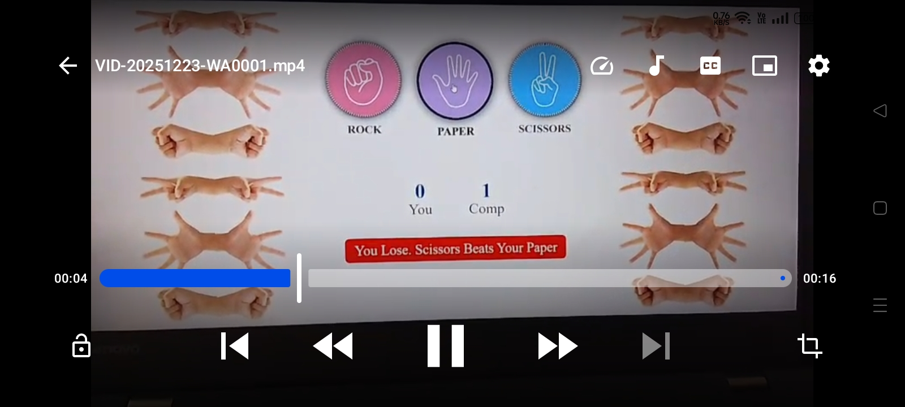

<div align="center">
# Nosved Player



[](https://github.com/DevSon1024/Nosved-Player/releases/latest)
[](https://github.com/DevSon1024/Nosved-Player/releases)
[](LICENSE)

[](https://developer.android.com)

</div>

**Nosved Player** is a clean, modern, and high-performance local video player for Android. Built from the ground up using **Jetpack Compose** and **Media3 (ExoPlayer)**, it offers a premium media experience with a focus on simplicity and fluidity.

---

## 📱 Screenshots

<div align="center">




</div>

---

## Key Features

- **🚀 Performance-First Playback**: Powered by Google's Media3 (ExoPlayer) with integrated **FFmpeg decoders** for broad format support.
- **Modern Aesthetic**: A stunning UI built with **Material 3**, featuring dynamic theme support and smooth micro-animations.
- **Smart History**: Keep track of your journey with a "Continue Watching" section. Long-press any history card for a quick, animated delete.
- **🖼️ Fast Thumbnails**: Instant video previews powered by a custom MediaStore-optimized Coil integration.
- **📂 Folder Organization**: Easily browse your local storage with a grouped folder view.
- **Advanced Controls**: Gesture-based brightness/volume controls, playback speed adjustment, and aspect ratio switching.
- **Subtitle Support**: Full support for internal and external subtitle tracks (SRT, ASS, VTT, etc.).

---

## 🛠️ Technical Stack

- **UI Framework**: [Jetpack Compose](https://developer.android.com/jetpack/compose)
- **Playback Engine**: [Android Media3 / ExoPlayer](https://github.com/androidx/media)
- **Image Loading**: [Coil](https://github.com/coil-kt/coil) (with custom VideoFrame and MediaStore fetchers)
- **Local Database**: [Room Persistence Library](https://developer.android.com/training/data-storage/room)
- **Native Decoders**: FFmpeg (via Nextlib)
- **Language**: Kotlin 100%

---

## Just Starting

### Requirements

- Android Device running API 26+ (Android 8.0 Oreo or higher)
- [Android Studio Ladybug](https://developer.android.com/studio) or newer

### Building from Source

1. Clone the repository:
   ```bash
   git clone https://github.com/DevSon1024/Nosved-Player.git
   ```
2. Open the project in Android Studio.
3. Sync Project with Gradle Files.
4. Run the `app` module on your device.

---

## License

This project is licensed under the **MIT License** - see the [LICENSE](LICENSE) file for details.

---

## Developed By

**Devendra Sonawane** (DevSon)

Made with ♥ and Kotlin.
