<div align="center">

# Nosved Player


[](https://github.com/DevSon1024/Nosved-Player/releases/latest)
[](https://github.com/DevSon1024/Nosved-Player/releases)
[](LICENSE)
[](https://developer.android.com)
[-blue.svg>)](https://developer.android.com)

</div>

**Nosved Player** is a clean, modern, and high-performance local video player for Android. Built from the ground up using **Jetpack Compose** and **Media3 (ExoPlayer)**, it delivers a premium media experience with a focus on simplicity, fluidity, and Material You design.

---

## 📸 Screenshots

### Home & Navigation

<div align="center">
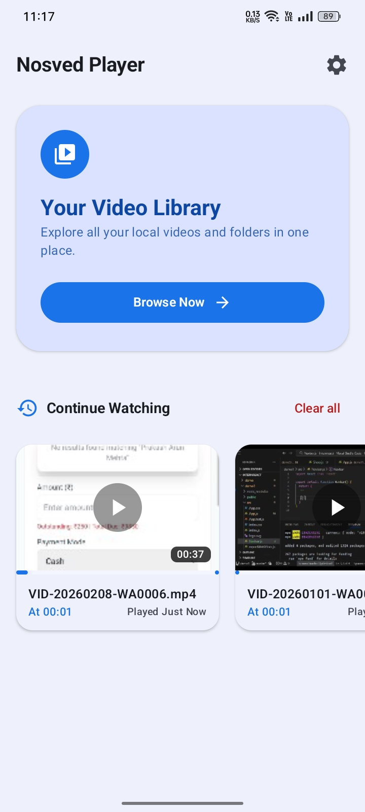
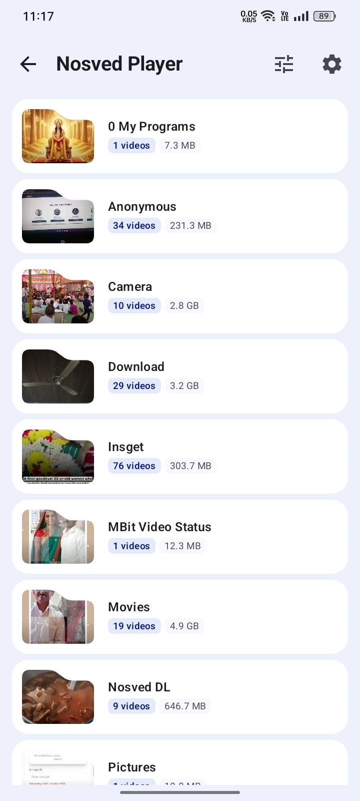
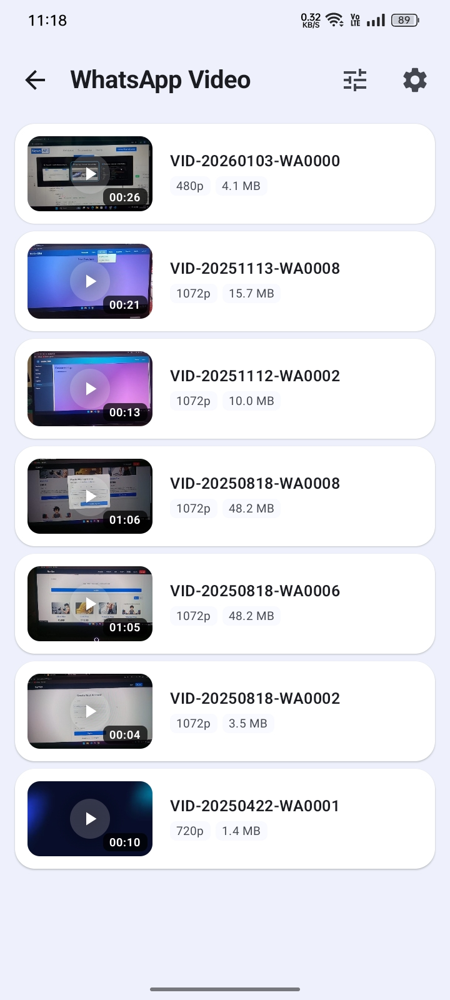
</div>

### Sort, View Settings & Rotary Wheel

<div align="center">
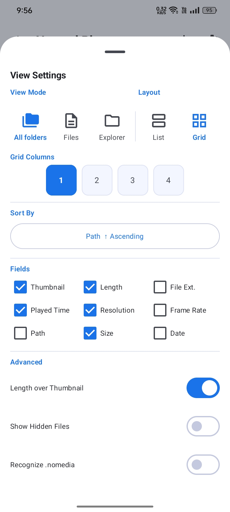
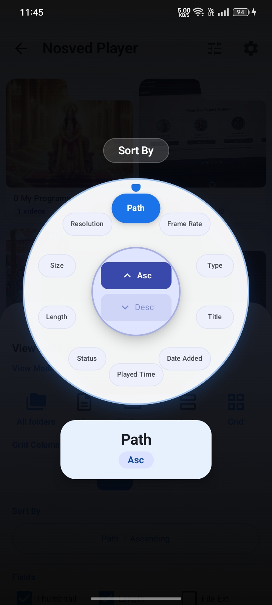
</div>

### Settings & About

<div align="center">
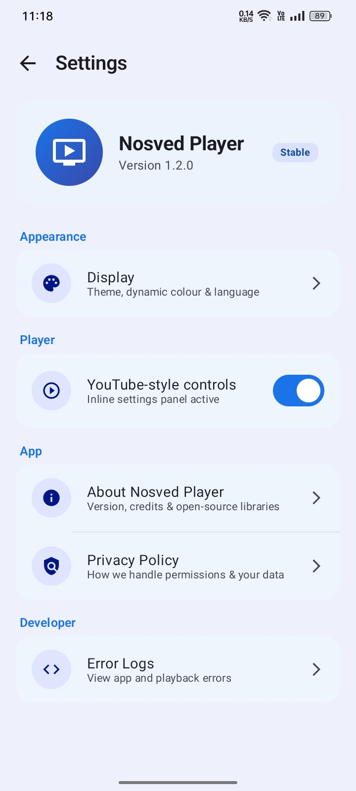
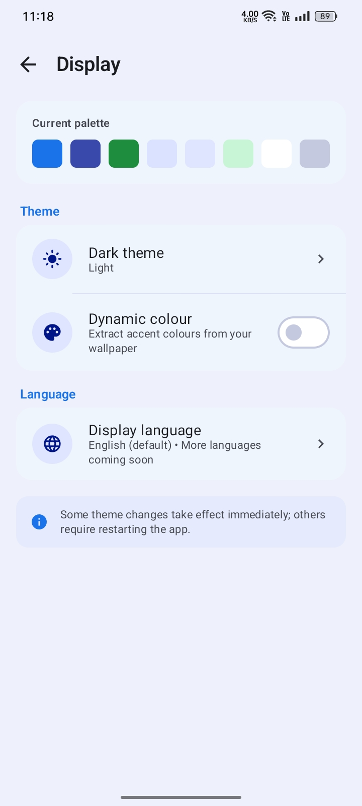
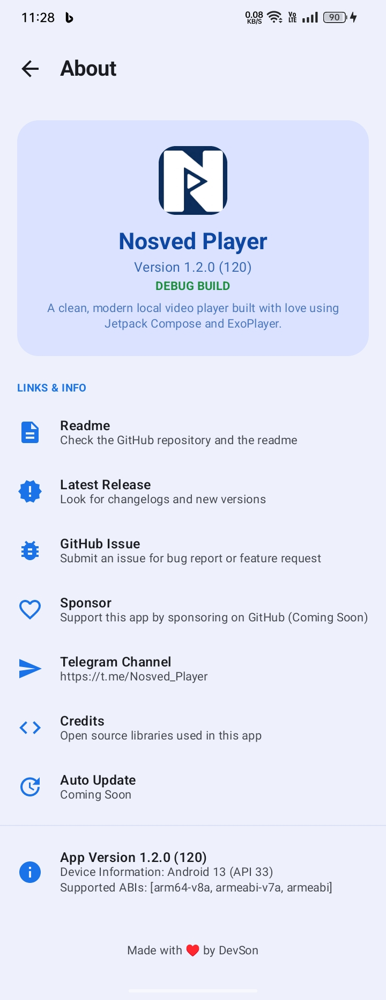
</div>

### Player - Default & YouTube Style (Landscape)

<div align="center">
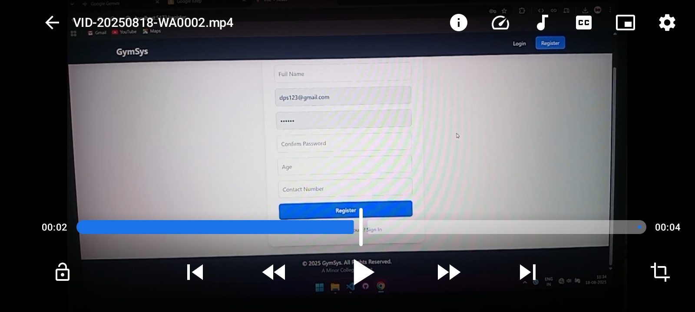
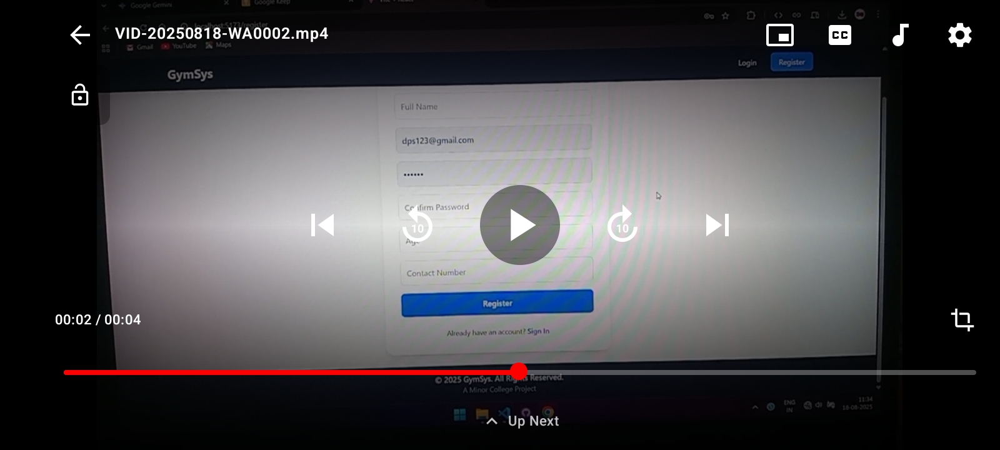
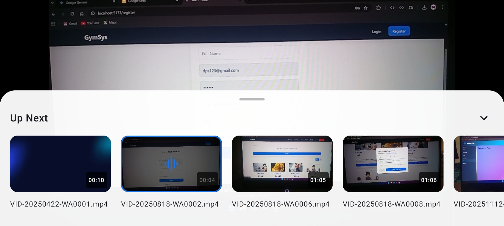
</div>

---

## ✨ Key Features

### 🎬 Dual Player UI

- **Default Style** - Clean, minimal controls with gesture-based brightness & volume adjustment.
- **YouTube Style** - Modern immersive controls with smooth multi-tap seek gestures, a swipe-up settings panel, Replay / Forward buttons, and an **Up Next** queue overlay.
- Switch between both styles anytime from **Settings → Player** or **Playback Settings → Player Style**.

### 🎡 Rotary Sort Wheel

- A unique **radial wheel picker** for sorting videos - spin to select sort field, tap centre buttons to toggle Ascending / Descending.
- Smooth spring-physics animations, Material You colour theming, and a polished system-bar-aware overlay.

### 🎨 Material You Dynamic Theme

- Full **Material 3** colour system with light and dark schemes.
- Optional **Dynamic Colour** - adapts to your wallpaper on Android 12+ devices.
- Status bar and navigation bar colours blend seamlessly with the app background.

### 📁 Smart Library

- **Continue Watching** - quick-access history cards with progress bars; long-press to delete.
- **Folder view** with multiple layout modes (All Folders, Files, Explorer, List, Grid).
- **Grid Columns** customisation for the video list.

### ⚡ Performance & Compatibility

- Powered by **Google Media3 / ExoPlayer** with integrated **FFmpeg** decoders (via Nextlib) for broad format support.
- Fast thumbnails using a custom **MediaStore-optimised Coil** integration.
- **Subtitle support** - internal & external tracks (SRT, ASS, VTT, etc.).
- **Gesture controls** - swipe for brightness, volume, seek, and aspect-ratio switching.

---

## 🛠️ Technical Stack

| Layer               | Technology                                                                                                                                           |
| ------------------- | ---------------------------------------------------------------------------------------------------------------------------------------------------- |
| **UI Framework**    | [Jetpack Compose](https://developer.android.com/jetpack/compose)                                                                                     |
| **Design System**   | Material 3 (Material You)                                                                                                                            |
| **Playback Engine** | [Android Media3 / ExoPlayer](https://github.com/androidx/media)                                                                                      |
| **Native Decoders** | FFmpeg via [Nextlib](https://github.com/anilbeesetti/nextlib)                                                                                        |
| **Image Loading**   | [Coil](https://github.com/coil-kt/coil) (VideoFrame + MediaStore fetchers)                                                                           |
| **Persistence**     | [Room](https://developer.android.com/training/data-storage/room) + [DataStore](https://developer.android.com/topic/libraries/architecture/datastore) |
| **Architecture**    | MVVM + Kotlin Coroutines + StateFlow                                                                                                                 |
| **Language**        | Kotlin 100%                                                                                                                                          |

---

## 🚀 Getting Started

### Requirements

- Android **API 26+** (Android 8.0 Oreo or higher)
- [Android Studio Meerkat](https://developer.android.com/studio) or newer

### Building from Source

```bash
git clone https://github.com/DevSon1024/Nosved-Player.git
```

1. Open the project in **Android Studio**.
2. **Sync** Project with Gradle Files.
3. Run the `app` module on your device or emulator.

---

## 📄 License

This project is licensed under the **MIT License** - see the [LICENSE](LICENSE) file for details.

---

## 👨‍💻 Developed By

**Devendra Sonawane** (DevSon)

Made with ♥ and Kotlin.

[](https://t.me/Nosved_Player)
[](https://github.com/DevSon1024)
